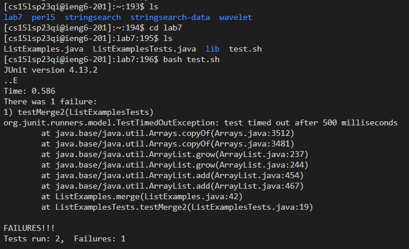
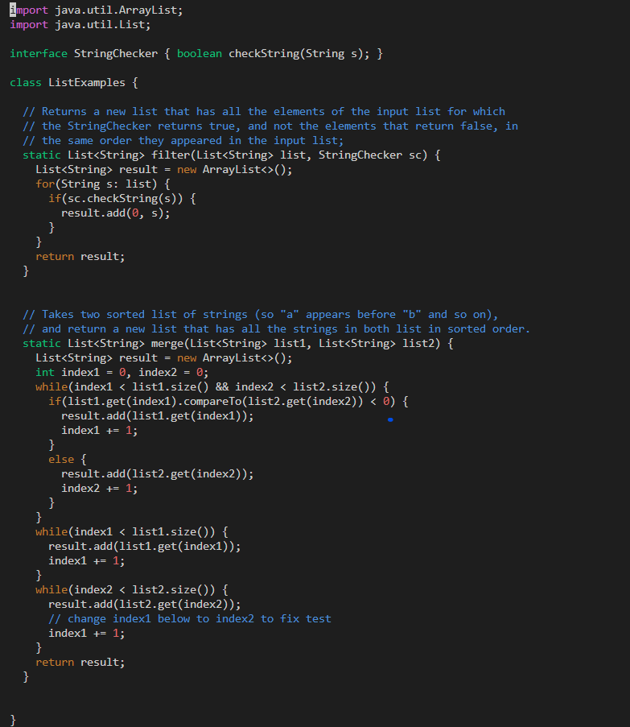
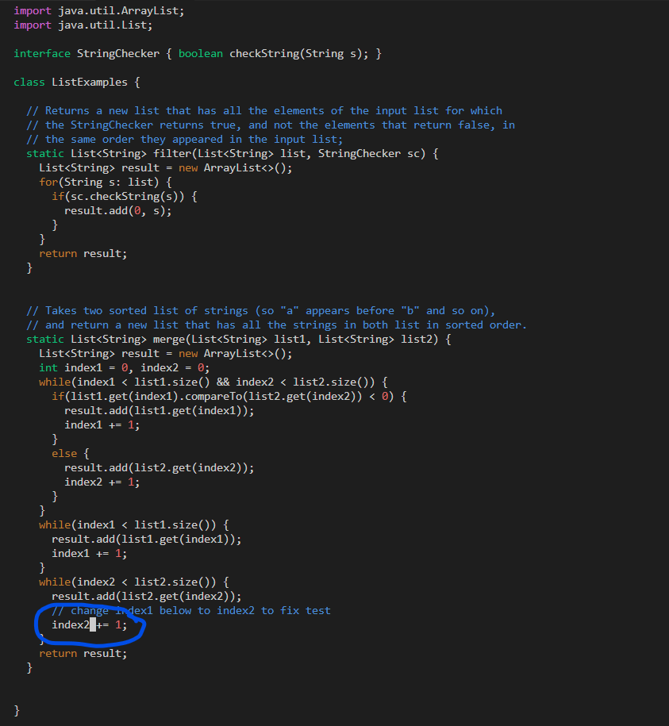

# Lab Report 4
---
## Hello there! For this lab report I will be doing what I had done in my  15L lab with the exact keys that I had used

### Step 4: Log into ieng6

- For this portion, I just had to write the command that gave me access to the ieng6 account, which is `ssh cs15lsp23qi@ieng6.ucsd.edu`
- To make it easier, I have used this exact command many times before so all i had to do was this to retrieve it: `<up><up>`
- After that, it just needs your password which then enabled me to get into the ieng6 server.

### Step 5: Clone your fork of the repository from your Github account
-This step, you need access to the repostiory we are using, which would be this: [Lab 7](https://github.com/ucsd-cse15l-s23/lab7)
- The command for this is `git clone https://github.com/ucsd-cse15l-s23/lab7`

- For this step i did not have to do anything much besides copying and pasting the link onto the command line using Ctrl + C and Ctrl +V and then pressing `<enter>`

### Step 6: Run the tests, demonstrating that they fail

- I first used the `ls` command to see if the lab7 directory was there. After that, I used `cd lab7` to be able to go into the lab7 directory and access the files needed for this lab. As always I had pressed `<enter>` to do what I am asking it to do
- For the actual tests, I had used a previous method that made it easier to run the tests Using `bash test.sh` and then pressing `<enter>` runs the test showing it had failed. The `test.sh` file has the different commands needed for us to do the tests, so it just makes it more efficient whenever we need to run it.

### Step 7: Use `Vim` to edit the code file
- In order to change the error, we are going to use the vim command, allowing us to directly change what is needed to fix the code, which in this case is the last while loop, changing index 1 to 2. We use the `vim ListExamples.java` command for this case (I also used the `<tab>` key to autocomplete ListExamples)

- Using the vim commands, I go down and left until I reach where I want to change
Keys Pressed: `<Down> times 30>`
-Then I go to where I have to change (L to go right, i to go into insert mode, and then change it and save and exit using :wq)
Keys Pressed:`<L> times 11`, `<i>`,`<backspace>`,`<2>`,`<escape>`, `<:wq>`

