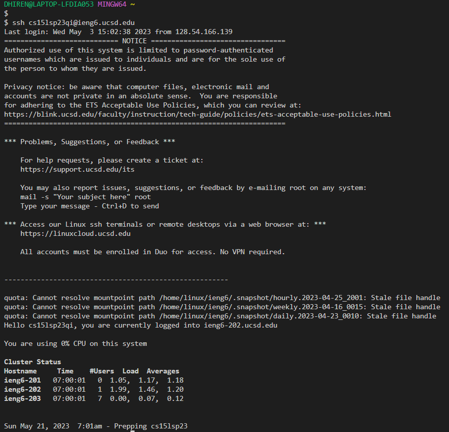
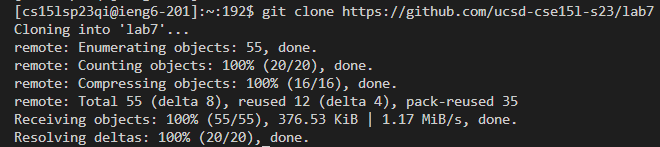

# Lab Report 4
---
## Hello there! For this lab I will be doing what I had done in my lab with the exact keys that I had used

### Step 4: Log into ieng6

- For this portion, I just had to write the command that gave me access to the ieng6 account, which is `ssh cs15lsp23qi@ieng6.ucsd.edu`
- After that, it just needs your password which then enabled me to get into the ieng6 server.

### Step 5: Clone your fork of the repository from your Github account
-This step, you need access to the repostiory we are using, which would be this: [Lab 7](https://github.com/ucsd-cse15l-s23/lab7)
- The command for this is `git clone https://github.com/ucsd-cse15l-s23/lab7`

